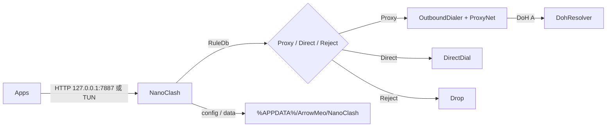

# 架构说明

## 仓库布局

| 路径 | 角色 |
|------|------|
| `Src/` | 单项目全部源码（`NanoClash.csproj`，`net10.0`） |
| `Build/` | `bin`、`obj`、中间 NativeAOT 目录 `pub/` |
| `Publish/` | 本地最终扁平发布 |
| `Res/` | 构建期嵌入资源（Rules / icon / wintun） |
| `Docs/` | 文档 |
| `Packages/` | 本仓库 NuGet 包缓存 |
| `Ref/` | 参考代码/文件（默认不入库） |
| `.cursor/rules/` | Agent / 项目约定 |

命名空间统一 `Clash` / `Clash.*`；程序集与产物名 `NanoClash`。

## 模块依赖

```
Gui → Config / Inbound / Outbound / Tun
Inbound → Outbound / Rules / Net / IO
Outbound → ProxyNet / Dns / Config
Tun → Rules / Dns / Outbound / Net / IO   （不依赖 Inbound）
ProxyNet → Net（及 Config DTO）
Dns / Rules / Net → Utils
```

| 路径 | 职责 |
|------|------|
| `Program.cs` | 用户目录就绪、Windows 解压 wintun、恢复残留 TUN/代理、组装生命周期 |
| `Gui/` | `MainView`（Chrome / Nodes partial）、添加订阅对话框 |
| `IO/` | `DirectDial`、`Relay` / `TrafficCounters`、`TlsHelloCoalesce`（HTTP 与 TUN 共用） |
| `ProxyNet/` | VLESS / Trojan / REALITY / Vision |
| `Outbound/` | `OutboundDialer`、`HealthChecker` |
| `Inbound/` | HTTP `:7887`；系统代理（Win / macOS / GNOME / Unsupported） |
| `Net/` | `DirectNetwork`（禁用系统代理回环）、`InterfaceBinder` |
| `Tun/` | Windows System TCP TUN、`WintunBootstrap`、路由与崩溃恢复 |
| `Config/` | 订阅索引、`ContentStore`、多格式 `NodeCatalog`、过滤与 YAML/URI 解析 |
| `Dns/` | DoH、Fake-IP 池、公网 DoH/DoT 黑名单 |
| `Rules/` | CFWR `RuleDb`（嵌入或旁路文件） |

## 运行时数据流（简图）



Windows 增强模式另经 WinTUN 收发包，System TCP Listen + NAT 后再走同一套规则与出站。

## 用户数据与嵌入资源

| 类别 | 位置 | 说明 |
|------|------|------|
| 订阅索引 / 正文 | `%APPDATA%\ArrowMeo\NanoClash` | `config.yaml` + `data/{sha256}` |
| wintun.dll | 同上 | 仅 Windows：内嵌解压后 `NativeLibrary.Load` |
| Rules.bin | 仓库仅 `Res/Rules.bin.gz` 嵌入；运行时解压到用户目录；可选 exe 旁覆盖 | 内容变化时覆盖用户目录副本 |
| 图标 | 嵌入 | PE + 窗口 `IconSource` |
| 系统代理 undo | 用户目录 `proxy-undo.json`（及 mac/GNOME 对应文件） | 崩溃恢复系统代理 |
| 日志 | （无） | 已移除 `FileLogger` / `log.txt` |

内容存储：`ContentStore` 只接受 64 位 hex 哈希文件名，路径必须落在 `DataDir` 内，防止穿越。

## 安全与权限注意

- Windows 增强与部分网络配置需要**管理员**（开增强时再提权）。
- 系统代理与 TUN 路由改动失败时应回滚；启动时尝试清理上次崩溃残留。
- 出站与订阅拉取强制绕过系统代理，避免回环。

更细的操作说明见 [`guide.md`](guide.md)；构建见 [`build.md`](build.md)。
