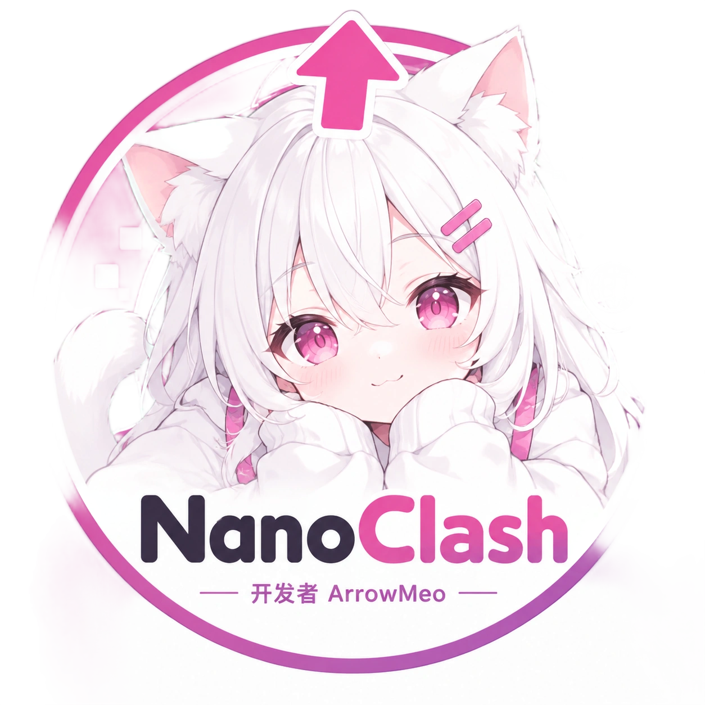

<p align="center">
  
</p>

# NanoClash

基于 **.NET 10 / C# 14** 的轻量跨平台代理客户端。源码只在 `Src/`，命名空间 `Clash.*`，程序集名 `NanoClash`。GUI 使用 MewUI（Windows Direct2D / Linux X11·XWayland / macOS MewVG）。

## 功能概览

| 能力 | 说明 |
|------|------|
| HTTP 入站 | 仅 `127.0.0.1:7887`（CONNECT leftover / early data）；无 SOCKS |
| 分流 | 内嵌 `Rules.bin.gz`（启动解压到用户目录；可选 exe 旁 `Rules.bin` 覆盖） |
| 订阅 | 云端 URL / 本地文件；数据在用户目录；支持更新与删除 |
| 出站 | 内嵌 ProxyNet（VLESS / Trojan，含 REALITY·Vision） |
| DNS | 节点与 TUN Direct 走 DoH（主 AliDNS `223.5.5.5`，备 DNSPod）；HTTP Direct 用系统 DNS |
| 代理模式 | 系统 HTTP(S) 代理 → 本机 `:7887`（Win / macOS / GNOME） |
| 增强模式 | **仅 Windows**：WinTUN + System TCP + Fake-IP |
| 发布 | NativeAOT + full Trim；可选 UPX `--lzma`；本地扁平 `Publish/`；CI 三 RID |

## 快速开始

```bat
build.bat
Publish\NanoClash.exe
curl -x http://127.0.0.1:7887 https://www.google.com/ -v -o NUL
```

```bash
chmod +x build.sh && ./build.sh
./Publish/NanoClash
```

用户数据：`%APPDATA%\ArrowMeo\NanoClash`（Linux/macOS 为对应 Application Data 路径下的同名目录）。

## 文档

| 文档 | 内容 |
|------|------|
| [`Docs/guide.md`](Docs/guide.md) | 使用说明：订阅、代理/增强模式、DNS、GUI、验证 |
| [`Docs/build.md`](Docs/build.md) | 构建、发布、嵌入资源与 CI |
| [`Docs/architecture.md`](Docs/architecture.md) | 目录布局、模块依赖、数据落盘 |
| [`Docs/README.md`](Docs/README.md) | 文档索引 |

## 目录一览

| 路径 | 作用 |
|------|------|
| `Src/` | 全部应用源码（单项目） |
| `Build/` | `bin` / `obj` / 中间发布 `pub/` |
| `Publish/` | 本地最终 AOT 产物（扁平） |
| `Res/` | 嵌入资源（Rules / icon / wintun） |
| `Docs/` | 文档 |
| `Packages/` · `Ref/` | NuGet 缓存 · 参考资料（默认不入库） |
| `build.bat` / `build.sh` | 还原 / 编译 / 发布 / 清理 |
